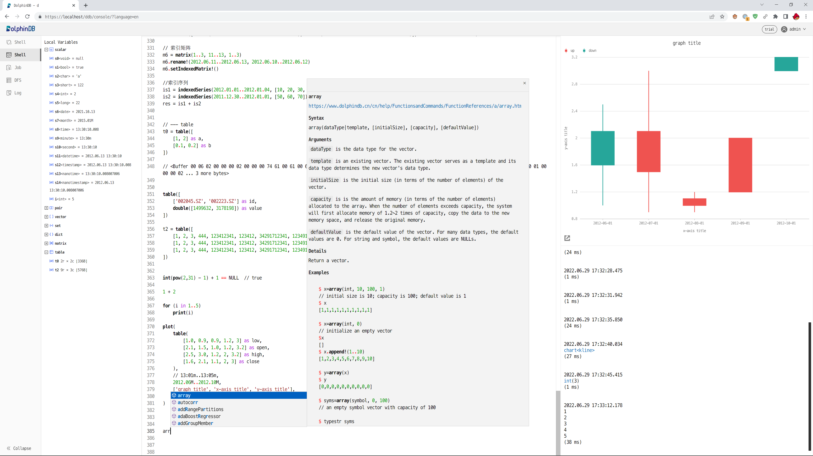
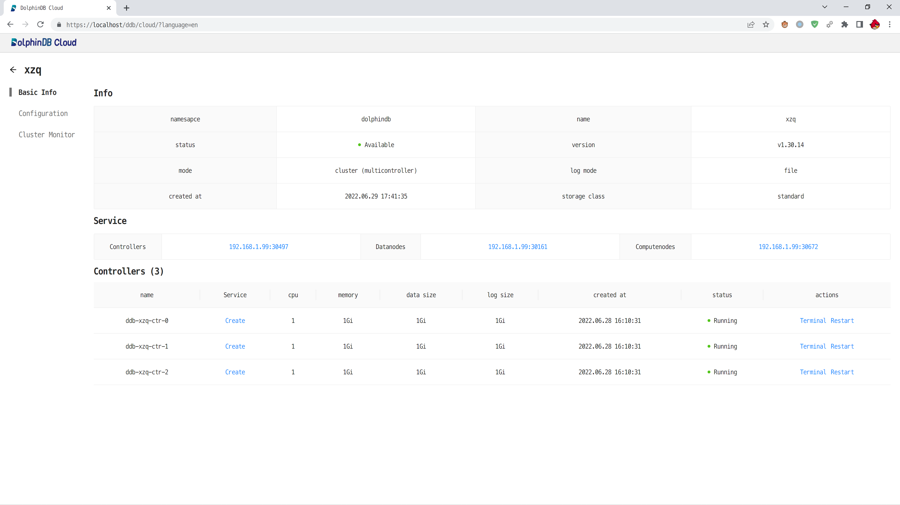

# DolphinDB Web

<p align='center'>
     
</p>

<p align='center'>
     <a href='https://github.com/dolphindb/api-javascript' target='_blank'>
         
     </a>
</p>

## English | [中文](./README.zh.md)

### Console: DolphinDB database web management interface


<!-- #### Online Version
The latest build of the web has been deployed to a CDN . You can connect the opened web interface to any remote or local DolphinDB server by setting the hostname and port parameters in the URL, for example:
http://cdn.dolphindb.cn/web/index.html?view=shell&hostname=115.239.209.123&port=8892

(If a blank page is displayed after opening, you need to manually click the address bar and change the url to a link starting with http://)
 -->
#### Offline Local Deployment (no need to restart the server, hot replacement is possible)
```shell
# cd the directory where the dolphindb executable is located
cd /path/to/dolphindb-dir/

# backup existing web folder (or delete: rm -rf ./web/)
mv ./web/ ./web.2023.01.01/

# Use curl or other tools to download the latest zip archive
curl -O https://cdn.dolphindb.cn/assets/web.latest.zip

# Unzip the zip package
unzip ./web.latest.zip

# Confirm the update is successful
ls -lhF ./web/

# If it is a cluster, synchronize to other machines through rsync to ensure that the timestamp (mtime) is consistent, otherwise the http cache will not take effect
rsync -av --delete ./web/ root@192.168.1.204:/path/to/dolphindb-dir/web/
```

Use a browser to access `ip:port` of DolphinDB server to use

If you need to deploy to a subpath through nginx (not recommended, one more forwarding will reduce performance), you can refer to [./nginx.conf](./nginx.conf)

### Cloud: DolphinDB K8S cloud platform web management interface


https://github.com/dolphindb/Tutorials_EN/blob/master/k8s_deployment.md


### Development
```shell
# Install the latest version of nodejs
# https://nodejs.org/en/download/current/

# Install the pnpm package manager
npm install -g pnpm

git clone https://github.com/dolphindb/web.git

cd web

# Install project dependencies
pnpm install

# Copy .vscode/settings.template.json to .vscode/settings.json
cp .vscode/settings.template.json .vscode/settings.json

# Refer to scripts in package.json

# development
pnpm run dev

# scan entries
pnpm run scan
# Manually complete untranslated entries
# Run the scan again to update the dictionary file dict.json
pnpm run scan

#lint
pnpm run lint

#lint fix
pnpm run fix
```
